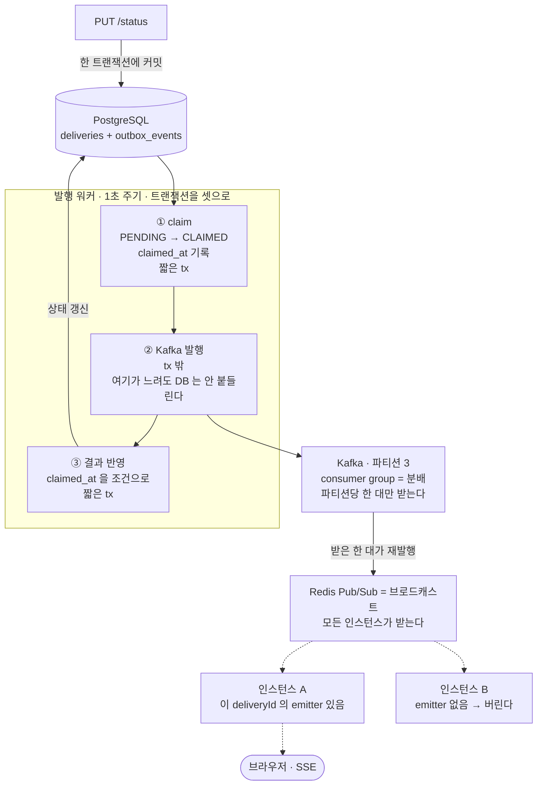

# realtime-delivery-tracking

배송 상태가 바뀌면 화면에 바로 뜨게 하고 싶었다. 그런데 **DB가 커밋한 것만, 빠짐없이, 어느 인스턴스에 붙은 사용자에게든** 이라는 조건이 붙는 순간 간단한 일이 아니게 된다. 그 조건을 하나씩 채워 가는 기록이다.

Kotlin / Spring Boot 4 / jOOQ / PostgreSQL 16 / Kafka / Redis · 테스트 40건

**기록** — [1편 SSE 레지스트리 동시성](https://logcat-io.github.io/posts/sse-registry-concurrency/) · [2편 Outbox·Kafka·Redis 팬아웃](https://logcat-io.github.io/posts/multi-instance-fanout-kafka-redis/)



**실선은 도달이 보장되는 구간, 점선은 보장이 없는 구간이다.** 커밋된 것은 Outbox 가 브로커까지 책임진다. 그 뒤 Redis Pub/Sub 은 저장하지 않고 SSE 는 그냥 열려 있는 TCP 연결이라, 구독자가 없는 순간의 메시지는 사라진다.

Kafka 와 Redis 를 둘 다 쓰는 이유가 그림에 있다 — **컨슈머 그룹은 나눠 주고, Pub/Sub 은 모두에게 준다.** 필요한 건 후자인데 Kafka 만으로는 전자가 되어서, 받은 한 대가 Redis 로 다시 뿌린다.

---

## 왜 시작했나

### 겪은 것 — 알림이 실패하면 결제가 롤백됐다

알림톡 발송이 비즈니스 로직 안에 같이 있었다. 발송이 예외를 던지면 그게 `@Transactional` 에 묶여 **결제와 신청까지 롤백**됐다. 고객은 아무 문제 없이 다 마쳤는데 실패로 처리된다.

원인은 전부 고객 밖에 있었다. 발송사 장애, 네트워크 오류, 그리고 템플릿 키를 문자열로 하나씩 박아 둔 탓에 생긴 오타까지. **부가적인 일이 주된 일을 죽이고 있었다.**

그래서 발송을 떼어내 `@Async` 로 비동기화하고 전용 스레드풀을 뒀다. 알림이 안 가더라도 결제는 성공하도록.

**그런데 멱등이 없었다.** 같은 알림톡이 연달아 3번 나간 적이 있다. 로그를 보니 발송사가 아니라 **우리 서버가 중복으로 보낸 것**이었다. 그건 고치지 못하고 회사를 옮겼다.

다음 회사에서 알림 서버를 설계할 때 그걸 먼저 잡았다. **나갈 이벤트를 DB 에 쌓는 데까지를 비즈니스 로직이 책임지고, 실제 발송은 별도 주체가 가져가고, dedup 키로 중복을 막는 구조** — Outbox 다.

**그런데 거기서도 브로커는 안 썼다.** 단일 RDB 위에서 끝냈고, 그 구조의 상한이 어디인지 모른 채로 넘어왔다. 발송량이 DB write 와 폴링 주기를 넘기면 그 테이블이 병목이 된다는 건 알았지만, 그 지점을 만난 적은 없다.

### 안 겪어 본 것 — 상태를 가진 프로세스를 늘리면?

다중 인스턴스 자체는 겪었다. 오토스케일링으로 늘었다 줄었다 하는 API 서버였고, 그걸로 문제가 난 적은 없다.

**문제가 없었던 건 그게 stateless 였기 때문이다.** 어느 인스턴스가 요청을 받든 결과가 같으니, 인스턴스가 몇 대인지는 신경 쓸 일이 아니었다.

SSE 는 거기서 갈린다. **연결이 프로세스 메모리에 산다.** 발행하는 프로세스와 연결을 가진 프로세스가 같아야만 동작한다는 뜻이고, 그 순간 "어느 인스턴스냐"가 갑자기 중요해진다. 인스턴스가 셋이고 사용자 X 가 A 에 붙어 있는데 이벤트가 B 로 가면 X 는 못 받는다 — Kafka consumer group 은 **부하를 나누는** 도구지 모두에게 뿌리는 도구가 아니니까.

시작할 때는 여기까지가 문서로 읽어서 아는 것이었다. 상태를 가진 프로세스를 늘려 놓고 직접 확인해 본 적이 없었고, Kafka 도 돌아가는 걸 봤을 뿐 토픽을 설계하고 파티션 키를 정해 본 적이 없었다.

**여기까지 오면서 그 두 개가 채워졌다.** 무엇이 어떻게 깨졌고 왜 그 도구를 골랐는지는 아래 결정 기록에 남긴다.

### 그래서 순서를 뒤집었다

Kafka를 쓰고 싶었다. 그런데 **쓰고 싶다는 이유로 먼저 깔면, 이 프로젝트가 경계하려는 바로 그 짓**이 된다. 도구가 문제를 정의하게 두는 것.

그래서 SSE 하나로 시작했다. 단일 인스턴스에서는 그걸로 충분했고, 충분하다는 것도 실제로 확인했다. **인스턴스를 둘로 늘려 무엇이 먼저 깨지는지 본 다음 Kafka 를 들였다.** Redis Pub/Sub 도 같은 순서였다 — Kafka 만으로 덮이지 않는 지점을 만나고 나서 판단했다.

배우려고 시작한 게 맞다. 오히려 그래서 순서를 지키고 싶었다. **필요를 겪고 나서 들여야, 다음에 같은 상황을 만났을 때 그게 정말 필요했는지 판단할 근거가 남는다고 생각한다.** 먼저 깔아 놓으면 잘 돌아가는지는 알아도 왜 필요했는지는 끝까지 모른다.

---

## 지금까지 내린 결정

기술을 먼저 고르지 않으려고 했다. **각 결정마다 무엇을 얻고 무엇을 포기했는지**를 남긴다.

### 상태 전이 규칙을 한 곳만 소유하게 했다

`DeliveryStatusManager` 하나가 "어느 상태에서 어디로 갈 수 있나"를 전부 안다. 컨트롤러나 어댑터에서 `when(status)`로 **한 번만 더** 분기하면 진실이 둘이 되는데, 그 둘은 시간이 지나면 어긋난다고 생각한다.

`CANCELLED`가 `PICKED_UP` 이후 불가한 것도 여기 있다 — 기사가 물건을 든 뒤엔 취소가 아니라 `FAILED`다. 이건 DB 제약으로 표현하기 어려운 도메인 규칙이라 코드가 지는 게 맞다고 봤다.

**다만 규칙만으로는 동시 요청을 못 막는다.** 두 요청이 같은 상태를 읽으면 각자 보기엔 정당한 전이라 둘 다 통과한다 — `READY_FOR_PICKUP`에서 하나는 `PICKED_UP`, 하나는 `CANCELLED`로. 그래서 갱신 조건에 읽은 상태를 넣었다(`WHERE id = ? AND status = ?`). 진 쪽은 0행이라 예외로 끝나고 이력도 이벤트도 안 나간다. 락을 잡지 않는 대신 진 요청이 실패하는 쪽을 택했다 — 이미 다른 상태로 갔으면 재시도해도 규칙에 걸리기 때문이다.

**대가:** 상태 하나 추가하면 전이표와 테스트를 같이 고쳐야 한다. 그래서 터미널 상태 테스트는 개별 조합 대신 `enum` 전체를 순회하게 짰다 — 값이 늘면 검증 범위가 따라서 는다.

### `status`를 DB enum 이 아니라 `VARCHAR` 로 뒀다

PostgreSQL `ENUM` 은 타입 안전하지만 **`ALTER TYPE ... ADD VALUE` 비용**이 붙는다. 값 추가가 트랜잭션 안에서 제한되고, 순서를 바꾸거나 값을 지우려면 타입을 새로 만들어 컬럼을 옮겨야 한다. 배송 상태는 도메인이 자라면 늘어날 값이라고 봤다.

그래서 저장은 `VARCHAR(30)`, **검증 책임은 애플리케이션이 진다.** DB는 문자열을 그대로 받고, 유효한 전이인지는 `DeliveryStatusManager` 가 판단한다.

**대가:** DB만 보면 아무 문자열이나 들어갈 수 있다. 애플리케이션을 우회한 직접 UPDATE 를 막지 못한다. 운영에서 손으로 상태를 고치는 일이 잦아지면 이 선택은 다시 봐야 한다.

### `core` 가 프레임워크를 모르게 했다

`core` 에는 Spring · jOOQ · Kafka · Redis import 가 **0건**이다. 순수 클래스라 `@Component` 를 못 붙이고, `application` 계층에서 손으로 빈 등록을 한다.

**대가:** 순수 클래스마다 등록 코드 한 줄이 는다.
**얻는 것:** 전이 규칙 테스트 16건이 **Spring Context 없이 0.03초**에 끝난다.

같은 이유로 `object` 와 빈을 갈랐다. 기준은 "상태가 있나"가 아니라 **"바꿔 끼울 일이 있나"** 다 — 규칙(`DeliveryStatusManager`)은 바뀌므로 빈, 포맷 유틸(`DeliveryTrackingNumberGenerator`)은 안 바뀌므로 `object`.

### SSE 레지스트리의 값을 `Set` 으로 뒀다

`Map<UUID, SseEmitter>` 1:1 이면 같은 배송을 보는 두 번째 화면이 첫 번째를 덮어쓴다. **덮어쓰인 쪽은 소켓이 살아 있어서 에러도 로그도 안 남는다.** 구매자·상담사·관리자가 같은 배송을 동시에 보는 건 예외가 아니라 정상 케이스라고 생각했다.

등록·제거는 `compute` / `computeIfPresent` 로 묶었다. `ConcurrentHashMap` 은 **개별 연산만** 원자적이라, "읽고 → 없으면 만들고 → 추가"를 나눠 쓰면 동시 등록 시 한쪽이 통째로 사라진다.

### 발행을 트랜잭션 밖으로 뺐다 (Outbox)

상태 변경 트랜잭션 안에서 Kafka 를 직접 부르면, 뒤에서 예외가 났을 때 **DB 는 롤백되고 메시지는 남는다.** 브로커에 트랜잭션 취소라는 개념이 없어서다. DB 에 없는 상태 변경이 화면에 뜨고, 새로고침하면 사라진다.

그래서 트랜잭션 안에서는 `outbox_events` INSERT 로 **의도만 적고**, 실제 발행은 워커(`fixedDelay = 1s`)가 `FOR UPDATE SKIP LOCKED` 로 집어 간다. 롤백되면 그 행도 같이 사라지므로 발행될 이벤트 자체가 없다.

**대가:** 커밋 즉시가 아니라 다음 주기에 나가고, 발행 후 마킹 전에 죽으면 중복 발행된다. Outbox 가 주는 건 **최소 한 번**이지 정확히 한 번이 아니다.

### 발행 트랜잭션을 셋으로 쪼갰다

Outbox 를 들이면서 트랜잭션 하나를 일부러 길게 뒀다. 워커가 `FOR UPDATE SKIP LOCKED` 로 집은 행을 **발행이 끝날 때까지 붙들어야** 다른 인스턴스가 같은 행을 안 가져가기 때문이다. 락을 쥐려면 트랜잭션이 살아 있어야 하고, 그 안에서 Kafka 를 동기 호출했다. 브로커가 느려지면 그 시간만큼 DB 커넥션이 잡혀 있는 구조다.

그래서 셋으로 끊었다.

```
① claim (짧은 tx)   PENDING → CLAIMED, claimed_at 기록 후 커밋
② 발행 (tx 밖)      Kafka 호출. 여기가 아무리 오래 걸려도 DB 는 안 붙들려 있다
③ 결과 반영 (짧은 tx)  PUBLISHED 또는 PENDING 복귀
```

락을 놓게 되니 "누가 집어갔다"는 표시가 사라진다. 트랜잭션이 끝나면 락도 같이 없어지니까. 그래서 그 표시를 **행 안에** 적었다 — `claimed_at` 이 그 자리다.

적어 두고 보니 이 값이 하나 더 한다. 회수된 뒤 늦게 깨어난 워커가 남의 결과를 덮는 창이 열리는데, 결과 반영 쿼리에 `claimed_at` 을 조건으로 걸면 그 쓰기가 0 행을 바꾸고 끝난다. **동시 접근은 `SKIP LOCKED` 가, 시차는 이 조건이 맡는다** — 둘은 다른 구간을 덮는다.

**대가:** `CLAIMED` 로 멈춘 행이 생긴다. 예전에는 프로세스가 죽으면 트랜잭션이 끊겨 DB 가 알아서 되돌려 줬는데, 락을 포기한 만큼 그 청소를 직접 해야 한다. 회수 스케줄러가 오래된 `CLAIMED` 를 `PENDING` 으로 되돌리고 `claimed_at` 을 비운다. 되돌릴 때 토큰까지 비우지 않으면 위의 fencing 이 다음 회차에 안 먹는다.

### 팬아웃을 Kafka 가 아니라 Redis 에 맡겼다

같은 그룹 안에서 한 파티션은 한 컨슈머에게만 배정된다. 이건 인스턴스를 하나 죽여 배정을 통제한 뒤 같은 코드에서 결과가 뒤집히는 걸로 확인했다. 컨슈머 그룹은 **처리량을 나누는** 장치라, 모든 인스턴스가 모든 이벤트를 받아야 하는 요구와는 반대편에 있다.

group id 를 인스턴스마다 다르게 주면 동작은 한다. 이 쪽은 실제로 돌려보진 않았고, 문서를 읽고 예상한 문제 때문에 접었다. 고유값으로 만들면 재기동마다 새 그룹이 생기니 죽은 그룹이 쌓이고, `earliest` 를 따라 과거 이벤트가 다시 나갈 것으로 봤다. 고정 번호로 만들면 인스턴스에 번호를 붙여야 해서 오토스케일링과 맞추기 어려워 보였다. 둘 다 브로커에 컨슈머가 인스턴스 수만큼 더 붙는 건 계산해 보면 나온다.

그래서 Kafka 는 그룹 1 개로 두고, 받은 인스턴스가 Redis 채널로 재발행한다. Redis Pub/Sub 이 저장하지 않는다는 성질은 보통 약점으로 꼽힌다. 다만 **SSE 연결도 지금 붙어 있는 것만 의미가 있어서, 이 경우엔 둘의 수명이 맞는다고 봤다.**

**대가:** 인프라가 하나 늘고, 팬아웃 구간에는 아무 보장이 없다. 구독자가 없는 순간의 메시지는 사라진다.

---

## 만들면서 알게 된 것

문서로 읽은 게 아니라 **직접 돌려서 관측한 것들.**

**Flyway 가 마이그레이션을 조용히 건너뛴다**

앱은 정상 기동하고 `/actuator/health` 도 `UP` 인데 테이블이 하나도 없었다. `public` 스키마에 함수 하나(`uuid_generate_v7()`)가 남아 있어서 Flyway 가 "비어 있지 않다"고 판정 → `baseline-on-migrate` 가 버전 1에 baseline 을 잡음 → **V0·V1 이 `≤ 1` 이라 통째로 스킵.** 로그에 ERROR 는 0건이고, 첫 쿼리를 날려야 터진다.

**SSE 는 첫 이벤트 전까지 응답 헤더도 안 보낸다**

연결 직후 클라이언트가 받는 건 **0바이트**다. 상태 변경이 한 번 일어나야 헤더(`Content-Type: text/event-stream`)와 프레임이 같이 나간다. 서버는 등록을 마쳤는데 클라이언트는 스트림이 열렸는지 알 수 없다.

**끊긴 연결은 다음 이벤트가 아니라 그다음 이벤트에서 걷힌다**

강제 종료 직후엔 콜백이 하나도 안 불린다. 그리고 닫힌 소켓에 대한 **첫 write 는 성공**한다 — 버퍼에 들어가기 때문이다. `Broken pipe` 는 두 번째 write 에서 나온다. 그래서 `onCompletion`·`onTimeout`·`onError` 세 콜백에 더해 **전송 실패 시 즉시 제거**하는 경로가 필요하다.

**`remove` 는 서로 다른 스레드에서 동시에 불린다**

죽은 구독자 하나에 `remove` 가 세 번, **두 스레드에서 1ms 안에** 들어왔다. 전송 실패 경로와 컨테이너 콜백이 같이 발화한 것이다. 멱등성만으로 부족하고 **동시 호출 안전성**이 필요하다는 뜻이라, 빈 집합 정리를 `computeIfPresent` 안에서 끝냈다.

**consumer group 은 "안 왔다"만으로 원인을 못 짚는다**

인스턴스를 둘로 늘리자 SSE 프레임이 오지 않았다. 파티션 배정이 원인이라고 보긴 했는데, 파티션 3 개에 인스턴스 2 대면 도달 확률이 1/3 이라 **4 회 연속 미도달은 확률 20% 로 그냥 나온다.** 회차를 늘려도 운을 완전히 지우지는 못한다. 8081 을 죽여 8080 이 파티션을 전부 가져가게 만들자 같은 코드에서 결과가 뒤집혔다. 확률을 빼야 인과가 남는다.

**커넥션 풀이 마를 거라 생각했는데 안 말랐다**

발행을 트랜잭션 밖으로 뺀 이유가 "브로커가 느려지면 커넥션이 잡힌다" 였으니, 그게 실제로 얼마나 아픈지 재보기로 했다. 고치기 전에 먼저 재야 비교할 게 생긴다. 브로커를 `docker pause` 로 얼리고 전/후 같은 절차로 돌렸다.

| | 도입 전 | 도입 후 |
|---|---|---|
| HikariCP active (최대) | 2 | 1 |
| HikariCP pending (최대) | **0** | **0** |
| outbox PENDING (최대) | 12,018 | 11,997 |
| `PUT /status` p95 | 8.94 ms | 9.18 ms |

풀이 20 인데 두 개를 썼다. 대기는 내내 0 이었고, 전후 차이도 0.2 % 라 사실상 같았다.

재고 나서야 이유를 알았다. `@Scheduled(fixedDelay)` 는 **직전 실행이 끝난 뒤** 다음을 시작하므로 같은 메서드가 겹치지 않는다. 그래서 폴러는 커넥션을 **구조적으로 한 개 넘게 못 쓴다.** 브로커가 아무리 느려도 "한 개를 오래" 붙들 뿐이고, 개수는 안 늘어난다. 부하가 모자랐던 게 아니라 이 구조에서는 날 수 없는 일이었다.

대신 예상 못 한 게 나왔다. 브로커를 멈추기 **전부터** 이미 쌓이고 있었다.

```
유입   60 /s     ← k6 실측. outbox 증가분 합계와도 일치한다
발행   36 /s     ← BATCH_SIZE 50 을 fixedDelay 1s 마다. 각 send().get() 이 왕복을 먹는다
──────────────
적체   24 /s     ← 브로커가 멀쩡한데도
```

브로커 지연은 이 위에 얹히는 2차 문제였고, 1차 문제는 애초에 못 따라가고 있었다는 것이다. 그래서 이 작업으로 **성능이 좋아졌다고는 쓸 수 없다.** 남는 건 커넥션 점유 시간이 짧아졌다는 사실과, 늦은 워커의 쓰기를 막게 됐다는 정확성 쪽이다.

측정 없이 뒀으면 "풀 고갈을 막았다" 고 적었을 것이다. 그게 제일 위험했다.

---

**통합 테스트가 로컬에 띄워 둔 인프라를 향하고 있었다**

Redis 구독자가 컨텍스트에 들어온 뒤로 outbox 테스트도 Redis 없이는 기동하지 못하는데, `@DynamicPropertySource` 에 Redis 가 빠져 있어 `application.yml` 의 고정 포트를 봤다. 로컬 docker-compose 가 떠 있는 동안은 **초록불이 뜨지만 검증 대상이 컨테이너가 아니다.** 내리는 순간 5 건이 컨텍스트 로딩에서 실패했다. 같은 함정을 PG·Kafka 는 막아 뒀는데 나중에 추가된 Redis 만 빠져 있었다.

---

## 만든 것

| 단계 | 상태 |
|---|---|
| 도메인 · 상태 머신 · 생성/상태변경 API | ✅ |
| SSE 실시간 전송 (단일 인스턴스) | ✅ |
| 트랜잭션 안에서 Kafka 직접 발행 — **의도된 dual write** | ✅ |
| Transactional Outbox — 커밋과 발행을 한 트랜잭션에 | ✅ |
| 다중 인스턴스 fan-out — Redis Pub/Sub | ✅ |
| 재연결 스냅샷 — 연결 시 마지막 상태 1건 | ✅ |
| 동시 상태 변경 — 갱신 조건으로 경합 차단 | ✅ |
| 발행 트랜잭션 분리 — claim → 발행 → 결과 반영 3단 | ✅ |
| 늦은 워커의 쓰기 차단 — 선점 시각 fencing | ✅ |
| 도입 전/후 대조 측정 | ✅ |

dual write 단계는 일부러 잘못 만든 것이다. **dual write 를 먼저 재현하고, 무엇이 아픈지 본 다음, 그것이 정당화하는 만큼만 Outbox 를 들였다.**

지금 파이프라인은 이렇게 흐른다.

```
[상태 변경 tx] → outbox_events → 워커(1s) → Kafka(3 partitions) → Consumer
                                                                     ↓
                          연결된 클라이언트 ← 모든 인스턴스 ← Redis Pub/Sub
                 └──── 도달 보장 ────┘        └──── 보장 없음 ────┘
```

앞쪽 절반은 Outbox 가 보장한다. 커밋된 것은 반드시 브로커까지 간다. **뒤쪽 절반은 아무것도 보장하지 않는다** — Redis Pub/Sub 은 fire-and-forget 이고 SSE 는 그냥 열려 있는 TCP 연결이다.

연결이 끊긴 사이의 공백은 재연결 스냅샷이 메운다 — 중간 과정을 재생하는 대신 붙는 순간의 마지막 상태 1건을 보낸다.

추적에서 사용자가 알고 싶은 건 지나온 모든 상태가 아니라 **지금 어디까지 왔는지**다. 지나온 이력이 필요하면 `delivery_status_history` 를 조회하면 된다. 이력은 남아 있고, 추적은 다른 일이다. 스트림에 재생까지 얹으면 같은 데이터를 두 경로가 주게 되는데, 그러다 어긋나면 어느 쪽이 맞는지 판단할 근거가 없어질 것 같았다.

**구독을 먼저 열고 그다음에 조회한다.** 순서를 뒤집으면 그 사이의 변경이 어느 emitter 에도 가지 않고 사라진다. 대신 같은 상태가 두 번 갈 수 있는데, 유실과 달리 중복은 `changedAt` 으로 거를 수 있다.

### 지금 시점의 한계

- 전역 예외 핸들러가 없다. 전이 규칙 위반과 조회 실패가 모두 `500` 으로 나간다
- 재연결이 받는 건 **마지막 상태 1건**이다. 끊긴 사이의 중간 과정은 재생하지 않는다
- 스냅샷과 실시간 이벤트가 같은 상태를 두 번 보낼 수 있다. 거르는 건 클라이언트 몫(`changedAt` 비교)
- Outbox 는 **최소 한 번**이다. 발행 후 마킹 전에 죽으면 같은 이벤트가 다시 나간다 — 소비 쪽 멱등이 없다
- 발행에 실패한 outbox 행을 격리하는 경로가 없다. 재시도는 상한 없이 반복된다
- 회수 임계는 측정 근거가 없는 잠정값이다. 정상 배치 1회의 최대 소요를 재고 정해야 맞다
- 발행 처리량이 유입을 못 따라간다. `BATCH_SIZE` 와 폴링 주기로 정해지는 상한인데, 바꿔가며 재보지는 않았다
- 이벤트가 더 나가지 않는 죽은 배송에 대한 emitter 는 타임아웃(30분)까지 남는다

---

## 구조

```
core/          도메인 — 모델, 상태 전이 규칙, 포트. Spring·jOOQ·Kafka 를 모른다
application/   유스케이스 — 트랜잭션 경계는 여기서만 연다
external/      어댑터 — 영속(jOOQ), 웹(SSE), 메시징(Kafka/Redis)
```

의존 방향은 `external → application → core` 단방향이다.

발행 경로는 세 번 갈아엎였다. SSE 직접 호출 → Kafka 직접 발행 → outbox 적재 후 워커 발행 → Kafka 소비 후 Redis 재발행. **그동안 `core` 와 `application` 은 한 글자도 안 바뀌었다** — 그게 이 구조를 택한 값이다.

`DeliveryEventPort` 하나가 도메인이 아는 전부다. 그 뒤에 브로커가 있는지 테이블이 있는지는 도메인이 몰라도 된다고 봤다.
